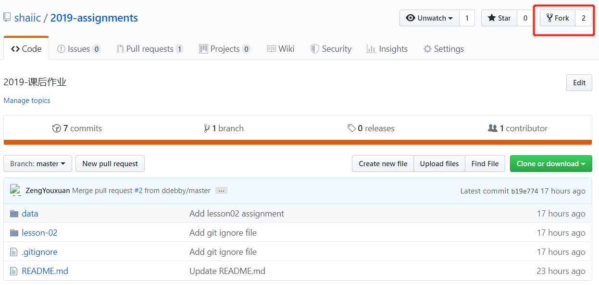
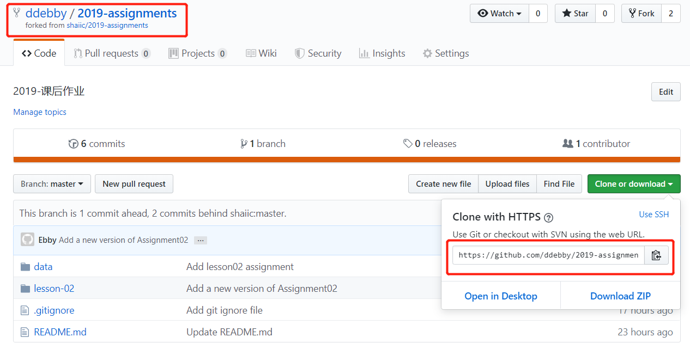
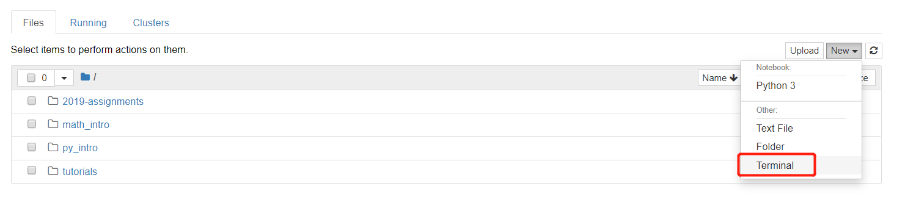
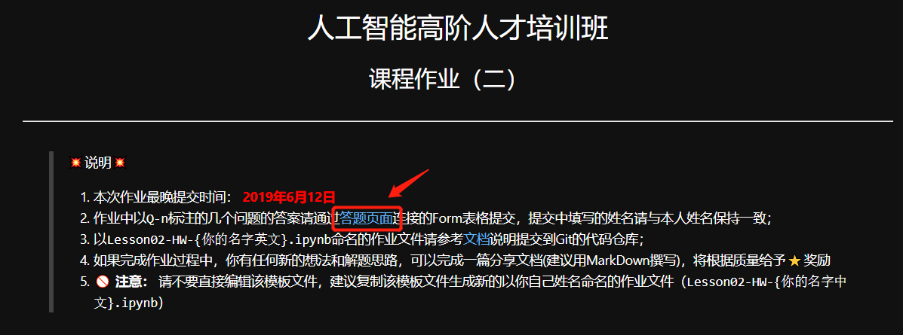
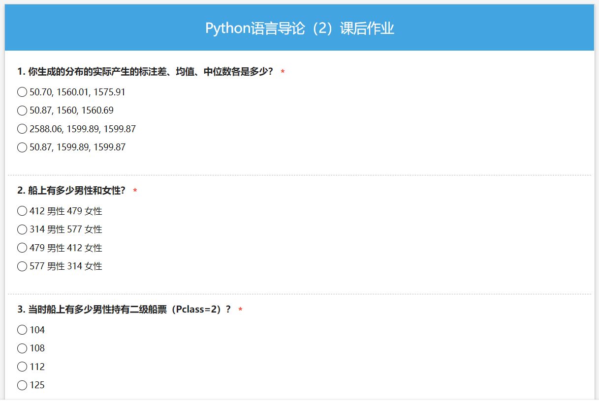
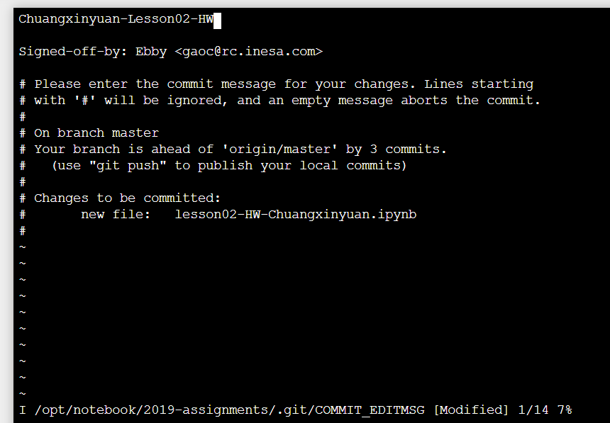
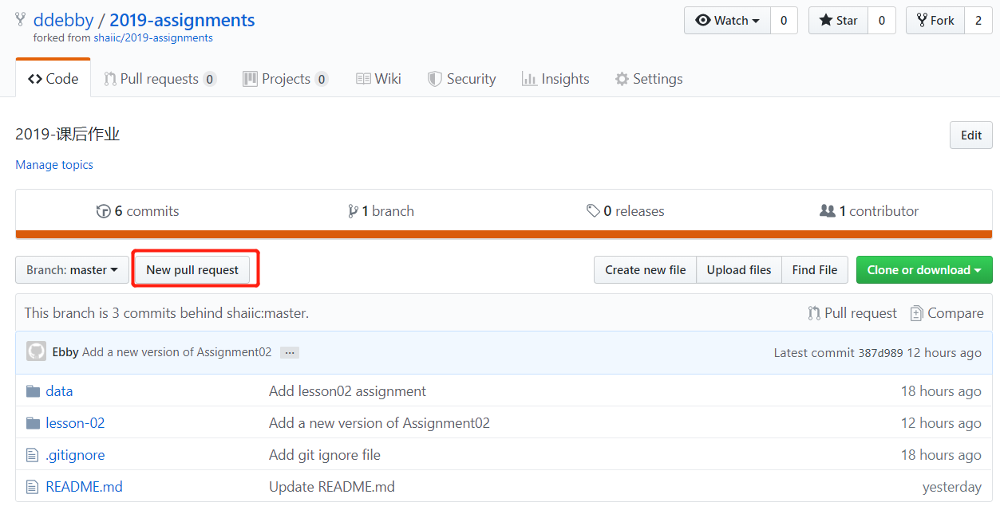
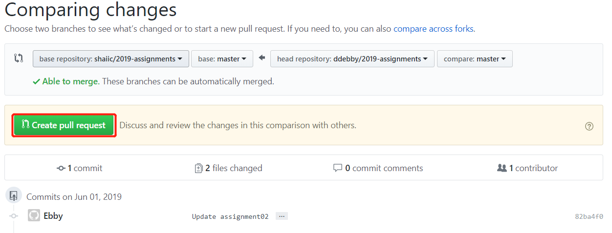
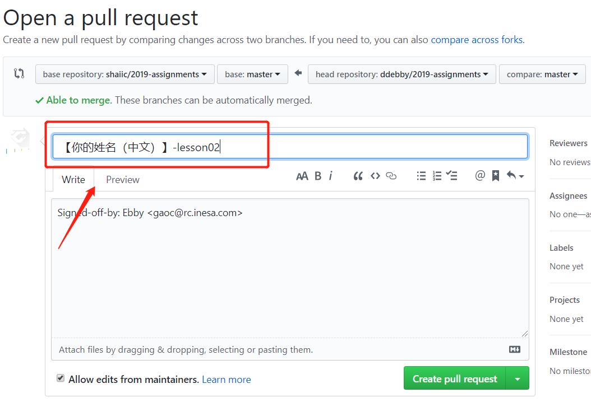

# 如何获得和提交作业

## 1. 如何获得作业 

> 如果是第一次获取作业，请执行1）- 7），如果不是第一次请直接执行8）

1） 登陆[https://github.com](https://github.com/)网站，注册一个Github账号，未来我们作业的发布将全部通过github上指定的代码仓库对外发布；

2）进入作业的[代码仓库位置](<https://github.com/shaiic/2019-assignments>),点击右上角的`Fork`按钮将作业仓库复制到你自己的代码仓库；



3）从自己的代码仓库获得作业地址,如下图所示（地址应该为`https://github.com/<你的账号名>/2019-assignments.git`）：



4）如果你使用的课程提供的Jupyter Notebook，请参考下图打开Terminal终端，如果你使用自己的环境，请使用git工具或bash命令行直接进行操作；



5）将作业代码仓库克隆到本地

在命令终端中，通过如下命令将作业仓库克隆到本地；

```bash
git clone https://github.com/<你的账号名>/2019-assignments.git
```

6) 为了后续更新作业方便，执行如下代码，将创新院作业仓库添加远程仓库：

```bash
cd 2019-assignments/
git remote add cxy https://github.com/shaiic/2019-assignments.git
```

7) 配置本地git环境

```bash
  git config --global user.email "you@example.com"
  git config --global user.name "Your Name"
```

8）从远程分支拉取最新的作业代码：

```bash
cd 2019-assignments/
git pull cxy master
```

## 2. 修改作业

进入作业目录，将作业模板复制为含自己名字的作业文件(以作业`lesson-02`为例)：

> 请不要直接在作业模板上修改作业

```bash
cd 2019-assignments/lesson-02/
cp lesson02-HW-\{Your-Name\}-v1.ipynb lesson02-HW-Chuangxinyuan.ipynb
```

编辑以你名字命名的作业文件

## 3. 提交作业

提交作业分为提交答案和提交作业文档两个部分。

### 3.1 提交答案

如下图所示，每个作业在开头部分都会提供一个作业的提交链接，点击链接打开表格，选择并填写答案，系统将自动进行评分。提交过程中，请务必准确填写姓名，每个人只有一次提交机会。



答题页面如下：



### 3.2 提交作业文档

作业文档的提交通过提交`Pull Request`的方式合并到作业的代码仓库。

1）执行如下操作，本地添加确认作业内容（以lesson02作业为例，此处`Chuangxinyuan`应该替换为你的名字）

```bash
git add lesson02-HW-Chuangxinyuan.ipynb
git commit -m "你的commit信息"
```

在提交的commit信息中填写你的基本信息，如下图所示：



> 如果使用的默认的Vim或Vi编译器，使用如下命令退出：1）先点击`ESC`,2)输入`wq`，3）回车

2）将代码修改先推送到自己仓库，执行如下代码

```bash
git push origin master
```

输入你的账号和密码，代码更新将更新到你的代码仓库；

3）登陆[https://github.com](https://github.com/)进入自己的仓库，如下图所示点击`pull request`，向远程分支提交PR请求：





在提交的PR中，请注明你的姓名：



点击`Create pull request`，作业文件提交完毕。
