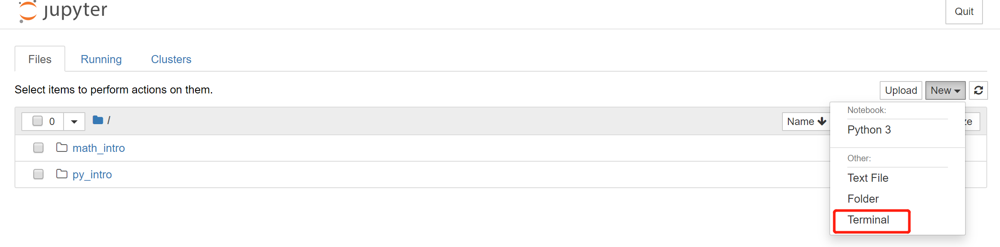
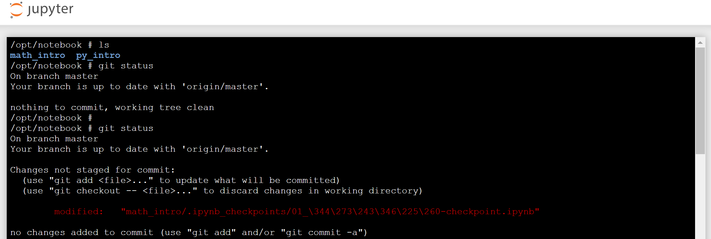

## 01.更新代码流程

1. 通过网址<http://notebook.a-stack.com:xxxx/>访问Jupyter Notebook，选择启动一个新的Terminal环境：





2. 通过 `git status`命令查看代码当前状态

   1）如果显示如下信息，代表当前分支干净，可以直接通过步骤3拉取最新代码；

   ```shell
   On branch master
   Your branch is up to date with 'origin/master'.
   
   nothing to commit, working tree clean
   ```

   2）如果显示如下信息，代表你在源代码基础上进行了修改：

   ```shell
   Changes not staged for commit:
     (use "git add <file>..." to update what will be committed)
     (use "git checkout -- <file>..." to discard changes in working directory)
   
           modified:   "math_intro/.ipynb_checkpoints/01_\344\273\243\346\225\260-checkpoint.ipynb"
           modified:   "math_intro/01_\344\273\243\346\225\260.ipynb"
   
   no changes added to commit (use "git add" and/or "git commit -a")
   ```

   > 由于Jupter Notebook本身采用标记语言编写，代码merge过程比较繁琐:
   >
   > - 可以通过`git checkout .`放弃对原文件所做的修改；
   > - 在一个分支上做了一些修改，在不想commit的情况下，切换分支，需要将修改的内容存储起来，请使用`git stash`命令;

3. 通过`git pull`命令，拉取远程分支的最新代码

## 了解更多git的使用

想了解更多git的使用技巧，请参考《Pro Git》。

> 《Pro Git》由GitHub员工Scott Chacon和另一位爱好者Ben Straub共同编写，主要介绍了Git使用基础和原理，适合Git爱好者和初学者参考。
>
> 可通过如下地址获取（另外本文末尾提供了不同格式下载的地址）：
>
> - 官网：<http://git-scm.com/book/en/v2>（第二版）
> - 中文翻译：<https://git-scm.com/book/zh/v2>（第二版）